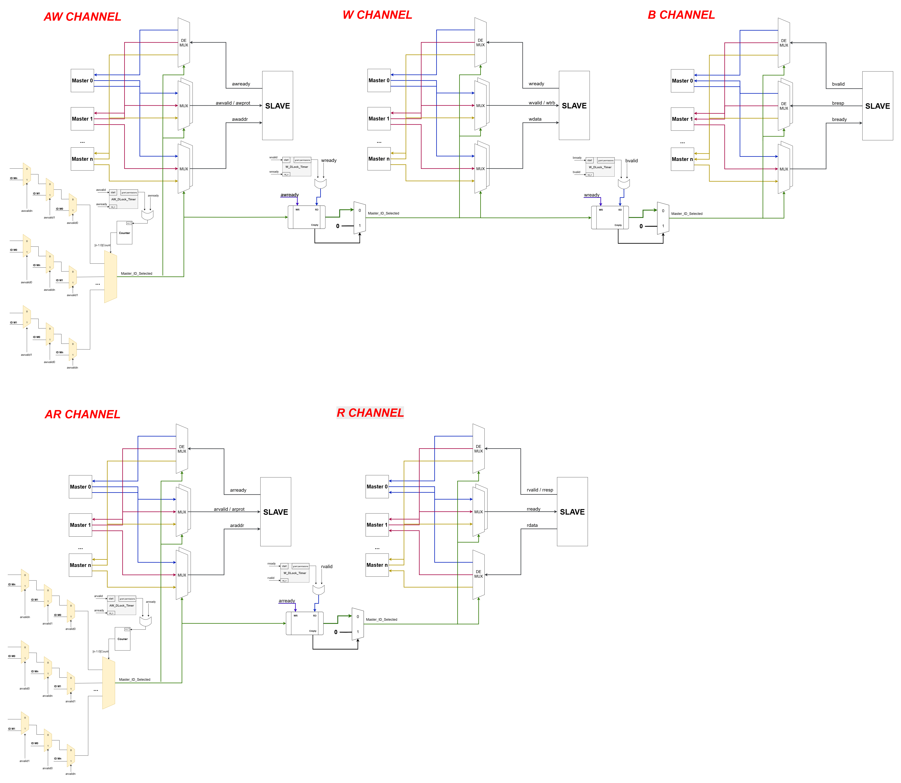
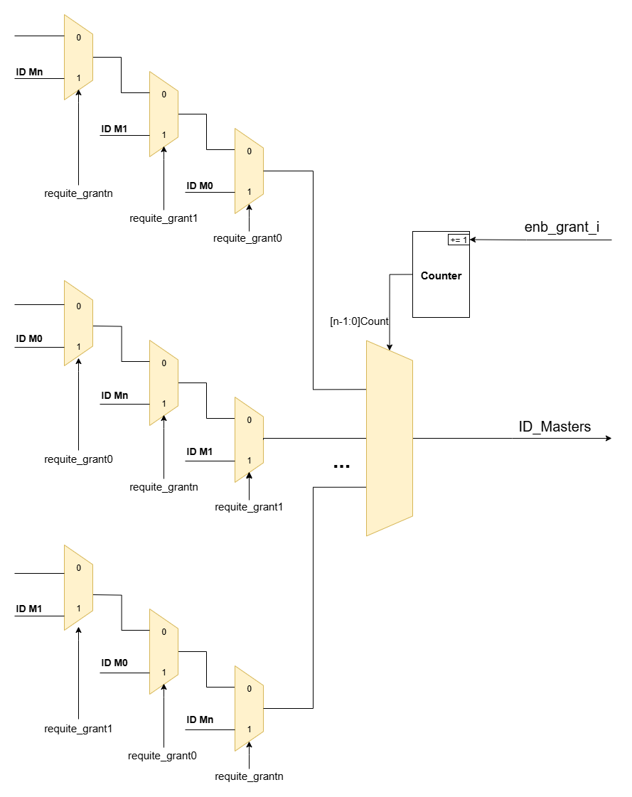

# Axi-Lite-Interconnect-HDL

# I. Introduction
 IP AXI Lite Interconnect core connects ONE upto MORE AXI memory-mapped master devices to ONE or MORE memory-mapped slave devices. The AXI interfaces conform to the AMBA® AXI version 4 specification from ARM®.

# II. Features
* The Master Interface (MI) can be configured to comprise 1-16 or more MI slots to issue 
transactions to up to 16 or more connected slave devices.
* The Slave Interface (SI) of the core can be configured to comprise 1-16 or more SI slots to accept transactions from up to 
16 or more connected master devices.
* Split Write Transaction and Read Transaction channels separately
* Address width: 32, 64 bits,...
* Interface data widths: 32, 64 bits,....
* Fixed priority, time quantum(avoid deadlock) and round-robin arbitration.

# III. Overview
* AXI is an interface specification that defines the interface of IP blocks, rather than the interconnect 
itself. The following diagram shows how AXI is used to interface an interconnect component:
> 

* AXI in a multi-master system:
> 

* AXI channels - The AXI specification describes a point-to-point protocol between two interfaces: a master and a 
slave. The following diagram shows the five main channels that each AXI interface uses for communication:  
> 
> 
Write operations use the following channels: 
* The master sends an address on the Write Address (AW) channel and transfers data on the Write 
Data (W) channel to the slave.   
* The slave writes the received data to the specified address. Once the slave has completed the 
write operation, it responds with a message to the master on the Write Response (B) channel.
 
Read operations use the following channels: 
* The master sends the address it wants to read on the Read Address (AR) channel.
* The slave sends the data from the requested address to the master on the Read Data (R) channel. 

**NOTE :** 
* **AW** for signals on the **Write Address** channel 
* **AR** for signals on the **Read Address** channel 
* **W** for signals on the **Write Data** channel
* **R** for signals on the **Read Data** channel 
* **B** for signals on the **Write Response** channel 

# IV. Concept AXI-LITE-INTERCONNECT

> 
>
## 1.  N-to-1 Interconnect
A common degenerate configuration of the AXI Interconnect core occurs when multiple master devices arbitrate for 
access to a single slave device, typically a memory controller.

In these cases, address decoding logic might be unnecessary and omitted from the AXI Interconnect core (unless the 
optional address range validation is enabled). Any of the optional conversion functions, such as data width and 
clock rate conversion, can also be performed in this configuration as shown in Figure 4.

>

Detail diagram:
>
## 2.  1-to-N Interconnect
Another degenerative configuration of the AXI Interconnect core occurs when a single master device, typically, a 
processor, accesses multiple memory-mapped slave peripherals. In these cases, arbitration (in the address and 
Write data paths) is not performed, as shown in Figure 5.

> 

Detail diagram:
>

## 3.  N-to-M Interconnect
Parallel Write and Read data pathways connect each SI slot to all the MI slots that it can access, according to the
configured sparse connectivity map. When more than one source has data to send to different destinations, data
transfers can occur independently and concurrently, provided AXI ordering rules are met.

The Write address channels among all SI slots feed into a central address arbiter, which grants access to one SI slot
at a time. It is also the case for the Read address channels. 

The winner of each arbitration cycle transfers its address information to the targeted MI slot, and pushes an entry
into the appropriate command queue(s) that enable various data pathways to route data to the proper destination
while enforcing AXI ordering rules.

> 

Detail circuit:
>

 
# V. Design AXI-LITE-INTERCONNECT

## 1.   Interconnect Architecture
> 

## 2. Detail circuit
For n to 1:
> 

For 1 to n:
> 

## 3.   Arbiter Module
>

Detail circuit:
>

# VI. Hierarchy module
    axi_lite_interconnect
        |-- axi_interconnect_n_1
        |-- axi_interconnect_1_n

# VII.   References
> *  [LogiCORE™ IP AXI Interconnect - XILINX](https://docs.amd.com/v/u/en-US/ds768_axi_interconnect)
> *  [Introduction to AMBA AXI4 Issue 0101 102202 - ARM](https://developer.arm.com/documentation/102202/0300/What-is-AMBA--and-why-use-it-)